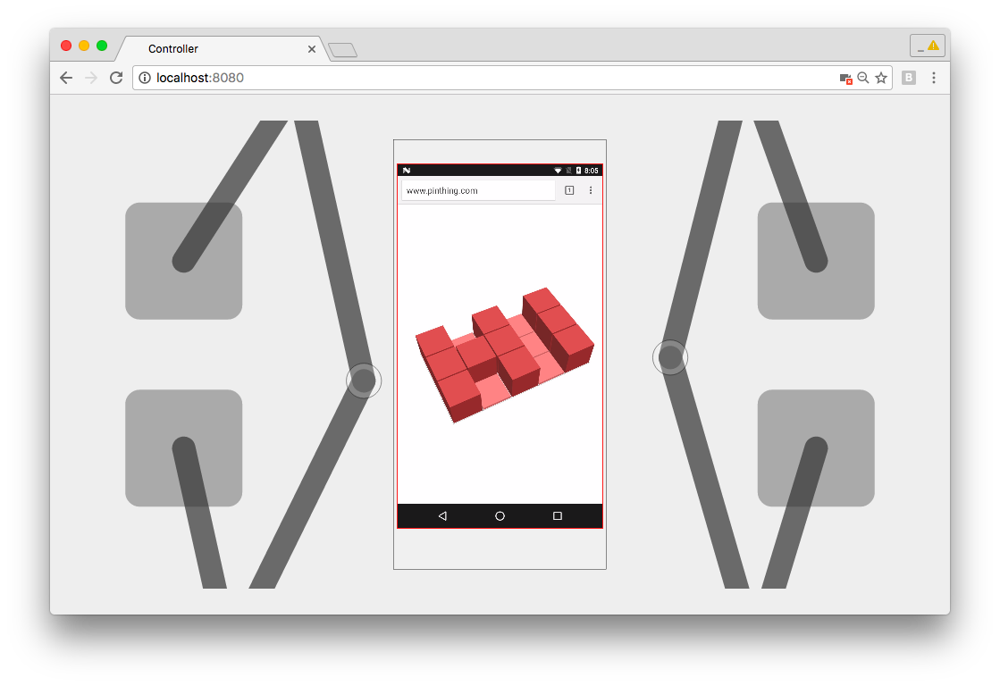

# Controller for Tapster Sidekick 
Web-based controller for the Tapster Sidekick robot

[](https://www.youtube.com/watch?v=MAu_O9O79Sc)

## Buidling

1.  install the required Node modules:
  ```
  npm install
  ```

2.  Download all git submodules. We include minicap as a Git submodule. And minicap includes libjpeg-turbo.
  ```
  git submodule update --init --recursive
  ```

3.  Build minicap. This requires compiling with the Android NDK:
  ```
  cd minicap
  ndk-build
  cd ..
  ```

  (You should now see the required Android binaries available in `./libs`.)

4.  Install minicap's Node modules:
  ```
  cd minicap/example
  npm install
  cd ../..
  ```
  


## Running

(*Make sure you have connected an Android device via USB and that USB debugging is enabled on the device.*)

1. Run server.js from the main checkout directory:
  ```
  node server.js
  ```

2. Open the controller URL:
  ```
  http://localhost:8080/
  ```
  
  
